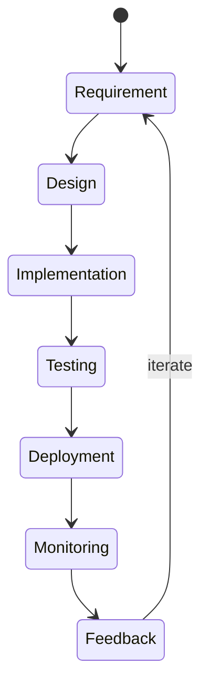
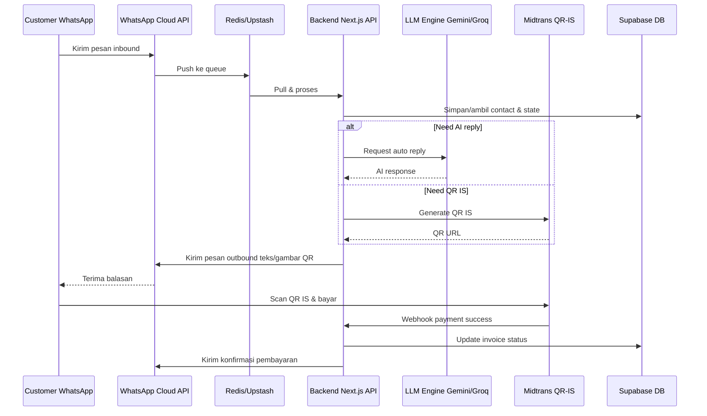

# AutoChat Hub - Architecture Diagrams (Mermaid Source)

## 1. Technical Architecture

```mermaid
graph TD
    FE[Frontend
Next.js (App Router)
Tailwind + Shadcn UI] -->|API Calls| BE
    subgraph Backend[Backend (Node.js)]
        BE[API Layer
Next.js API Routes]
        Auth[Supabase Auth]
        DB[Supabase PostgreSQL]
        REQ[Redis (Upstash)
Message Queue]
        WA[WhatsApp Engine
Meta Cloud API]
        WA_U[Baileys (fallback)
unofficial]
        PAY[Payment Gateway
Midtrans / Mayar (QR-IS)]
        LLM[LLM Engine
Gemini 1.5 Flash / Groq]
    end
    FE -->|Auth Token| Auth
    Auth --> DB
    BE --> DB
    BE --> REQ
    REQ --> WA
    REQ --> WA_U
    WA -->|Inbound/Outbound messages| FE
    WA_U -->|Inbound/Outbound messages| FE
    WA -->|Webhook events| PAY
    PAY -->|Payment status| BE
    BE --> LLM
    LLM -->|AI-generated reply| BE
    subgraph Cloud[Cloud Services]
        Vercel[Vercel (Edge Deploy)]
        SupabaseSC[Supabase (Realtime Auth / DB)]
        Upstash[Upstash Redis]
        MetaAPI[Meta WhatsApp Cloud API]
        Midtrans[Midtrans / Mayar API]
        Gemini[Google Gemini API]
    end
    Vercel --> FE
    SupabaseSC -.-> DB
    SupabaseSC -.-> Auth
    Upstash -.-> REQ
    MetaAPI -.-> WA
    Midtrans -.-> PAY
    Gemini -.-> LLM
    Alert[Alert/Log Service] -->|Error/Metric| BE
    Alert -->|Escalation| Founder[Founder (WhatsApp/Telegram)]
```

## 2. CI / CD Pipeline

```mermaid
flowchart TD
    subgraph CI[CI Pipeline]
        C1[Checkout repository] --> C2[Install deps (npm ci)] --> C3[Run lint & type-check] --> C4[Run unit / integration tests] --> C5[Build Next.js (npm run build)]
    end
    subgraph CD[CD Pipeline]
        D1[Deploy build artifacts to Vercel] --> D2[Preview URL generated] --> D3[Run smoke test (cypress/playwright)]
        D3 -->|OK| D4[Promote to Production] --> D5[Notify Slack / Discord]
    end
    C5 --> D1
```

## 3. SDLC Process



## 4. Business Model Canvas

```mermaid
graph LR
    A[Customer Segments] --> B[Value Propositions]
    B --> C[Channels]
    C --> D[Customer Relationships]
    D --> E[Revenue Streams]
    E --> F[Key Resources]
    F --> G[Key Activities]
    G --> H[Key Partnerships]
    H --> I[Cost Structure]
    subgraph Canvas[Business Model Canvas]
        A[Segmen
Klinik/Kecantikan
Bimbel & EduTech
Agen Properti
Fashion & F&B]
        B[Value Proposisi
Auto-reminder & no-show reduction
Auto-reply & drip-campaign
Instant QR-IS payment
Multi-agent inbox]
        C[Channels
WhatsApp Business Cloud
Landing-page (Vercel)
Demo WA bot
Agency partners]
        D[Hubungan
Self-service portal
Chat-support 24/7 AI-agent
Onboarding video
Community (Telegram)]
        E[Pendapatan
Subscription tiered (Starter/Growth/Scale)
Setup fee (optional)
Transaction fee (QR-IS)]
        F[Sumber Daya Utama
Supabase DB
Vercel hosting
Meta WA Cloud API
Midtrans/Mayar
LLM (Gemini/Groq)]
        G[Aktivitas Kunci
Pengembangan Front-end & API
Integrasi WA & Payment
CI/CD & monitoring
Dukungan AI-agent]
        H[Partner
Meta (WhatsApp)
Midtrans / Mayar
Supabase
Vercel
Cloud provider (Google)]
        I[Biaya
Layanan cloud (Supabase, Upstash, Vercel)
LLM token usage
Midtrans fee
Pengembangan & support]
    end
    classDef box fill:#2D2D44,stroke:#7C3AED,color:#FFF;
```

## 5. Data-Flow (WhatsApp <-> AI <-> QR-IS)


