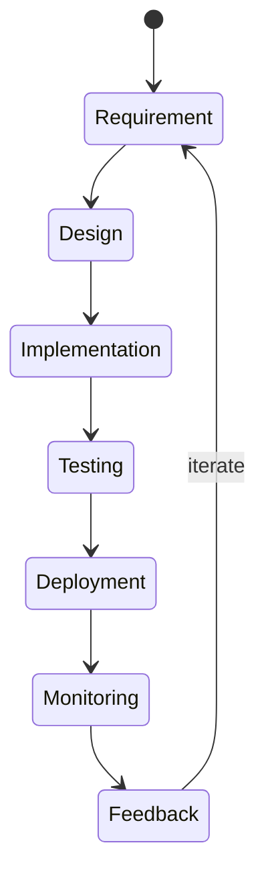
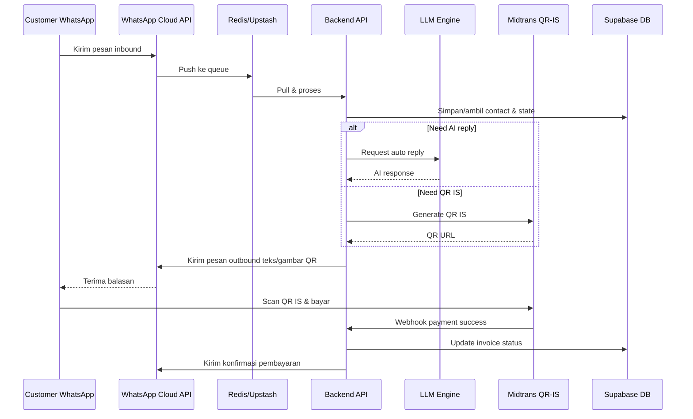

# AutoChat Hub – Architecture & Pipelines (Clean Mermaid)

## 1️⃣ Technical Architecture

```mermaid
graph TD
    FE[Frontend\nNext.js (App Router)\nTailwind + Shadcn UI] -->|API Calls| BE[Backend API Layer]
    subgraph Backend[Backend (Node.js)]
        BE[API Layer]
        Auth[Supabase Auth]
        DB[Supabase PostgreSQL]
        REQ[Redis (Upstash)\nMessage Queue]
        WA[WhatsApp Engine\nMeta Cloud API]
        WA_U[Baileys (fallback)]
        PAY[Payment Gateway\nMidtrans / Mayar (QR‑IS)]
        LLM[LLM Engine\nGemini 1.5 Flash / Groq]
    end
    FE -->|Auth Token| Auth
    Auth --> DB
    BE --> DB
    BE --> REQ
    REQ --> WA
    REQ --> WA_U
    WA -->|Inbound/Outbound| FE
    WA_U -->|Inbound/Outbound| FE
    WA -->|Webhook events| PAY
    PAY -->|Payment status| BE
    BE --> LLM
    LLM -->|AI reply| BE
    subgraph Cloud[Cloud Services]
        Vercel[Vercel Edge]
        SupabaseSC[Supabase (Realtime Auth/DB)]
        Upstash[Upstash Redis]
        MetaAPI[Meta WhatsApp Cloud]
        Midtrans[Midtrans API]
        Gemini[Google Gemini API]
    end
    Vercel --> FE
    SupabaseSC -.-> DB
    SupabaseSC -.-> Auth
    Upstash -.-> REQ
    MetaAPI -.-> WA
    Midtrans -.-> PAY
    Gemini -.-> LLM
    Alert[Alert/Log Service] -->|Error/Metric| BE
    Alert -->|Escalation| Founder[Founder (WhatsApp/Telegram)]
```.

## 2️⃣ CI / CD Pipeline

```mermaid
flowchart TD
    subgraph CI[CI Pipeline]
        C1[Checkout repository]
        C2[Install deps (npm ci)]
        C3[Run lint & type‑check]
        C4[Run unit / integration tests]
        C5[Build Next.js (npm run build)]
    end
    subgraph CD[CD Pipeline]
        D1[Deploy to Vercel]
        D2[Preview URL]
        D3[Run smoke test]
        D4[Promote to Production]
        D5[Notify Slack/Discord]
    end
    C5 --> D1
    D1 --> D2 --> D3 -->|OK| D4 --> D5
```

## 3️⃣ SDLC Process



## 4️⃣ Business Model Canvas (Ringkas)

```mermaid
graph LR
    A[Customer Segments] --> B[Value Propositions]
    B --> C[Channels]
    C --> D[Customer Relationships]
    D --> E[Revenue Streams]
    E --> F[Key Resources]
    F --> G[Key Activities]
    G --> H[Key Partnerships]
    H --> I[Cost Structure]
    subgraph Canvas[Business Model Canvas]
        A[Segmen\nKlinik/Kecantikan\nBimbel & EduTech\nAgen Properti\nFashion & F&B]
        B[Value‑Proposisi\nAuto‑reminder & no‑show reduction\nAuto‑reply & drip‑campaign\nInstant QR‑IS payment\nMulti‑agent inbox]
        C[Channels\nWhatsApp Business Cloud\nLanding‑page (Vercel)\nDemo WA bot\nAgency partners]
        D[Hubungan\nSelf‑service portal\nChat‑support 24/7 AI‑agent\nOnboarding video\nCommunity (Telegram)]
        E[Pendapatan\nSubscription tiered (Starter/Growth/Scale)\nSetup fee (optional)\nTransaction fee (QR‑IS)]
        F[Sumber Daya Utama\nSupabase DB\nVercel hosting\nMeta WA Cloud API\nMidtrans/Mayar\nLLM (Gemini/Groq)]
        G[Aktivitas Kunci\nPengembangan Front‑end & API\nIntegrasi WA & Payment\nCI/CD & monitoring\nDukungan AI‑agent]
        H[Partner\nMeta (WhatsApp)\nMidtrans / Mayar\nSupabase\nVercel\nGoogle Cloud]
        I[Biaya\nLayanan cloud (Supabase, Upstash, Vercel)\nLLM token usage\nMidtrans fee\nPengembangan & support]
    end
    classDef box fill:#2D2D44,stroke:#7C3AED,color:#FFF;
```

## 5️⃣ Data‑Flow (WhatsApp ↔ AI ↔ QR‑IS)


