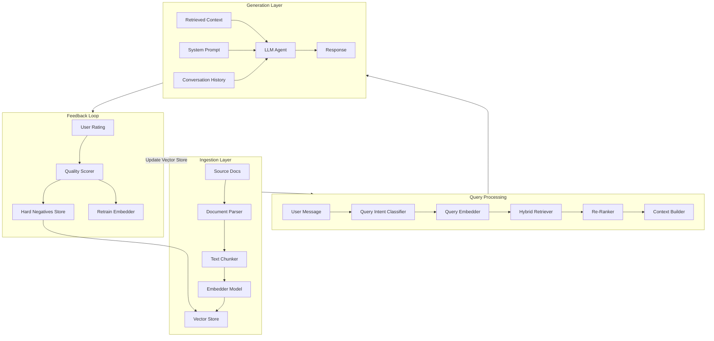

# AutoChat Hub — Master Blueprint (Rebuilt, Clean)

Berikut adalah **Blueprint Lengkap (End-to-End)** untuk membangun **OmniChannel Social Automation & CRM SaaS** yang siap dipasarkan ke industri dengan daya beli tinggi di Indonesia.

---

# 1. Target Industri Paling Membutuhkan di Indonesia

Jangan jual ke "semua orang". Fokus pada industri yang memiliki **biaya per akuisisi pelanggan (Customer Acquisition Cost) tinggi** dan **butuh interaksi personal**:

| Industri | Masalah Utama (Pain Point) | Nilai Jual SaaS Anda |
| :--- | :--- | :--- |
| **Klinik Kecantikan & Gigi** | Pasien sering lupa jadwal (*no-show* tinggi) | Reminder booking otomatis H-1 + Follow-up perawatan berkala (LTV tinggi). |
| **Bimbel, Kursus & EdTech** | Follow-up calon siswa baru lambat & penagihan SPP bulanan manual | Auto-reply info biaya, *drip campaign* info webinar, reminder tagihan via QRIS. |
| **Agen Properti / Sales Mobil** | *Lead* dari iklan Meta/TikTok lambat direspons sales | Form iklan langsung mentrigger chat WA dalam 10 detik + kualifikasi *budget* otomatis. |
| **Brand Fashion / F&B Lokal** | CS kewalahan saat promo; banyak *abandoned cart* | Auto-followup keranjang belanja web, update resi, *broadcast* katalog baru. |

---

# 2. Arsitektur Teknis & Tech Stack (Low Cost / Skalabel)

Anda bisa membangun SaaS ini secara bertahap mulai dari infrastruktur gratis/murah:

```
[ Frontend (Next.js) ] ── (Vercel)
         │
         ▼
[ Backend API & Auth ] ── (Supabase / Node.js)
         │
         ├─── [ Message Queue (Redis / Upstash) ] ── (Mencegah banned & rate limit)
         │                   │
         │                   ▼
         ├─── [ WhatsApp Gateway Engine ] (Meta Cloud API / Baileys Worker)
         │
         └─── [ Payment Gateway ] (Midtrans / Xendit / Mayar untuk QRIS)
```

### Rekomendasi Tech Stack:
* **Frontend Web App:** Next.js (App Router), Tailwind CSS, Shadcn UI (UI modern, ringan, responsif di HP & Desktop).
* **Database & Auth:** **Supabase** (PostgreSQL + Realtime websocket untuk chat live).
* **State & Message Queue:** **Redis via Upstash** (Sangat krusial untuk antrean pesan broadcast agar pengiriman tidak bersamaan/di-ban).
* **Payment Gateway:** **Midtrans** atau **Mayar.id** (Aktivasi instan QRIS dan Virtual Account).
* **2 Koneksi WhatsApp Engine:**
  * *Opsi A (Resmi & Stabil - B2B Mid/Enterprise):* **WhatsApp Business Cloud API (Meta)**. Bebas banned, tetapi pesan template keluar berbayar ke Meta.untuk range paket scale / pro
  * *Opsi B (Unofficial - Target UMKM/Budget):* Library open-source berbasis QR-scan seperti **Baileys** atau **WPPConnect** yang di-host di VPS murah (seperti Hetzner / DigitalOcean seharga $4–$5/bulan) untuk paket starter dan growth.

---

# 3. Core MVP Specification & Architecture

> **Deskripsi Singkat:**
> Platform *Social CRM & Conversational Commerce* berbasis WhatsApp Cloud API, Instagram DM, dan Facebook Messenger yang dirancang khusus untuk pasar bisnis di Indonesia (dilengkapi *Multi-Agent Inbox*, *Dynamic QRIS Generator*, dan *AI Auto-Responder*).

---

## 3.1 Tech Stack (Zero-to-Low Cost)

| Layer | Teknologi | Alasan Pemilihan |
| :--- | :--- | :--- |
| **Framework Fullstack** | **Next.js (App Router) + TypeScript** | Satu repo untuk frontend dashboard & backend API serverless. |
| **UI Library** | **Tailwind CSS + Shadcn UI + Lucide Icons** | Desain modern, cepat, dan 100% responsif mobile-desktop. |
| **Database & Auth** | **Supabase (PostgreSQL)** | Auth instan, storage file media chat, dan *Realtime WebSockets*. |
| **Queue & Rate Limiter** | **Upstash Redis (QStash / Redis)** | Menampung lonjakan webhook Meta & mencegah pemblokiran API. |
| **WhatsApp Engine** | **Meta WhatsApp Cloud API (v21.0+)** | Resmi dari Meta, legal, anti-banned, dan stabil. |
| **Payment Gateway** | **Midtrans / Mayar API** | Pembuatan Dynamic QRIS instan langsung di room chat. |
| **AI LLM Engine** | **Google Gemini 1.5 Flash API / Groq** | Latensi super cepat (< 1 detik) dengan biaya sangat murah / gratis tier awal. |
| **Hosting & Deploy** | **Vercel** | CI/CD otomatis, SSL gratis, dan latency edge server cepat. |

---

## 3.2 Cakupan Fitur Core MVP (Scope of Work)

```
                     ┌────────────────────────────────────────┐
                     │          AUTOCHAT HUB CORE MVP         │
                     └───────────────────┬────────────────────┘
                                         │
     ┌──────────────────┬────────────────┴─────────────────┬──────────────────┐
     ▼                  ▼                                  ▼                  ▼
[ 1. Webhook Engine ] [ 2. Shared Team Inbox ] [ 3. Conversational CRM ] [ 4. In-Chat QRIS ]
  - Handshake GET       - Realtime Chat List     - Kanban Pipeline Board   - Generate QRIS
  - Message Ingestion   - Multi-Agent Filter     - Contact Tags & Notes    - Auto-Confirm Webhook
  - Status Updates      - AI Quick Reply / FAQ   - Lead Qualification      - Resi & Invoice PDF
```

### Modul 1: Webhook & Messaging Engine
* [x] **Meta Verification Handshake:** Endpoint `GET /api/webhook` untuk verifikasi token Meta.
* [x] **Inbound Message Receiver:** Endpoint `POST /api/webhook` untuk menangkap teks, gambar, dan tombol pesan masuk.
* [x] **Outbound Dispatcher:** Service untuk mengirim pesan balasan teks, template interaktif, dan media via Meta Graph API.
* [x] **Message Status Tracking:** Memperbarui status centang satu (*sent*), centang dua abu-abu (*delivered*), dan centang dua biru (*read*).

### Modul 2: Shared Team Inbox (Realtime)
* [x] **Universal Chat Window:** 1 nomor WhatsApp bisnis dapat diakses banyak staf CS secara bersamaan.
* [x] **Live Message Sync:** Percakapan masuk dan keluar ter-update *realtime* tanpa perlu refresh halaman (via Supabase Realtime).
* [x] **Assign to Agent:** Fitur menetapkan percakapan ke CS tertentu agar tidak terjadi duplikasi penanganan.
* [x] **Quick Replies:** Template balasan instan untuk pertanyaan umum yang sering ditanyakan pelanggan.

### Modul 3: Conversational CRM & Kanban
* [x] **Visual Sales Pipeline:** Drag-and-drop kolom status (`Lead Masuk` ➔ `Follow Up` ➔ `Terkirim Tagihan` ➔ `Deal/Selesai`).
* [x] **Contact Management:** Menyimpan nama pelanggan, nomor WhatsApp, tag kustom (misal: *VIP*, *Belum Bayar*), dan catatan internal.
* [x] **Trigger Otomatis:** Mengirim pesan WhatsApp otomatis saat status prospek digeser ke kolom tertentu.

### Modul 4: In-Chat Dynamic QRIS Payment
* [x] **Generate QRIS Instan:** CS memasukkan nominal tagihan dan deskripsi barang di samping room chat.
* [x] **Kirim Gambar QRIS Otomatis:** Bot mengirim gambar QRIS dinamis langsung ke nomor WhatsApp pelanggan.
* [x] **Payment Webhook Notification:** Begitu pembeli scan & bayar via BCA/GoPay/OVO/ShopeePay, sistem otomatis mengirim pesan terima kasih + status pesanan langsung berubah ke *Deal/Paid*.

---

## 3.3 Skema Database Inti (Supabase SQL Schema)

```sql
-- 1. PROFILES (CS & ADMIN)
CREATE TABLE profiles (
    id UUID PRIMARY KEY REFERENCES auth.users(id) ON DELETE CASCADE,
    full_name VARCHAR(100) NOT NULL,
    role VARCHAR(20) DEFAULT 'agent',
    is_online BOOLEAN DEFAULT false,
    created_at TIMESTAMP WITH TIME ZONE DEFAULT NOW()
);

-- 2. CONTACTS (LEADS / CUSTOMERS)
CREATE TABLE contacts (
    id UUID PRIMARY KEY DEFAULT gen_random_uuid(),
    wa_id VARCHAR(30) UNIQUE NOT NULL,
    name VARCHAR(150),
    pipeline_stage VARCHAR(50) DEFAULT 'lead_masuk',
    assigned_to UUID REFERENCES profiles(id) ON DELETE SET NULL,
    tags TEXT[] DEFAULT '{}',
    custom_notes TEXT,
    created_at TIMESTAMP WITH TIME ZONE DEFAULT NOW()
);

-- 3. MESSAGES (CHAT LOGS)
CREATE TABLE messages (
    id UUID PRIMARY KEY DEFAULT gen_random_uuid(),
    contact_id UUID NOT NULL REFERENCES contacts(id) ON DELETE CASCADE,
    sender_type VARCHAR(10) NOT NULL,
    agent_id UUID REFERENCES profiles(id) ON DELETE SET NULL,
    message_type VARCHAR(20) DEFAULT 'text',
    content TEXT NOT NULL,
    media_url TEXT,
    status VARCHAR(20) DEFAULT 'sent',
    meta_message_id VARCHAR(100),
    created_at TIMESTAMP WITH TIME ZONE DEFAULT NOW()
);

-- 4. INVOICES / ORDERS (QRIS TRANSACTIONS)
CREATE TABLE invoices (
    id UUID PRIMARY KEY DEFAULT gen_random_uuid(),
    contact_id UUID NOT NULL REFERENCES contacts(id) ON DELETE CASCADE,
    order_id VARCHAR(50) UNIQUE NOT NULL,
    amount NUMERIC(12, 2) NOT NULL,
    status VARCHAR(20) DEFAULT 'pending',
    qris_url TEXT,
    paid_at TIMESTAMP WITH TIME ZONE,
    created_at TIMESTAMP WITH TIME ZONE DEFAULT NOW()
);
```

---

# 4. Skema Database Sederhana (PostgreSQL / Supabase)

```sql
-- 1. Tabel Kontak / Pelanggan
CREATE TABLE contacts (
    id UUID PRIMARY KEY DEFAULT gen_random_uuid(),
    business_id UUID REFERENCES businesses(id),
    name VARCHAR(255),
    phone_number VARCHAR(20) NOT NULL,
    status VARCHAR(50) DEFAULT 'lead',
    custom_fields JSONB,
    created_at TIMESTAMP WITH TIME ZONE DEFAULT NOW()
);

-- 2. Tabel Pesan Chat (Realtime)
CREATE TABLE messages (
    id UUID PRIMARY KEY DEFAULT gen_random_uuid(),
    business_id UUID REFERENCES businesses(id),
    contact_id UUID REFERENCES contacts(id),
    sender_type VARCHAR(10),
    message_text TEXT,
    media_url TEXT,
    is_read BOOLEAN DEFAULT false,
    created_at TIMESTAMP WITH TIME ZONE DEFAULT NOW()
);

-- 3. Tabel Automations / Flow
CREATE TABLE automations (
    id UUID PRIMARY KEY DEFAULT gen_random_uuid(),
    business_id UUID REFERENCES businesses(id),
    trigger_keyword VARCHAR(100),
    action_payload JSONB,
    is_active BOOLEAN DEFAULT true
);
```

---

# 5. Model Monetisasi & Struktur Harga (Pasar Indonesia)

| Paket | Target | Fitur | Rekomendasi Harga |
| :--- | :--- | :--- | :--- |
| **Starter** | Olshop / Bisnis Solo | 1 Nomor, 2 CS Login, Auto-Reply Dasar, 1.000 pesan/bln | **Rp99.000 / bulan** |
| **Growth** | Klinik, Bimbel, F&B | 1 Nomor, 5 CS, CRM Pipeline, Flow Automation, Integrasi Webhook | **Rp249.000 / bulan** |
| **Scale / Pro** | Properti, Agensi, Brand | Multi-Nomor, CS Tanpa Batas, AI Chatbot Training, Integrasi API | **Rp599.000 / bulan** |

---

# 6. Strategi Go-To-Market (Cara Menjualnya di Awal)

1. **Jual ke 1 Niche Dulu (Contoh: Klinik Kecantikan/Gigi):**
   * Cari 50 akun Instagram klinik kecantikan/gigi di kota sekitar Anda.
   * Hubungi nomor admin mereka: "Halo Dok/Kak, kami punya software yang bisa otomatis kirim reminder jadwal pasien via WA supaya pasien tidak lupa hadir. Mau coba gratis 14 hari?"
2. **Buat Demo Interaktif di Landing Page:**
   * Di web utama SaaS Anda, pasang tombol: "Coba demo chat otomatis kami via WhatsApp (Klik di sini)". Saat calon klien mengklik tombol tersebut, bot WA Anda mendemonstrasikan fiturnya langsung ke nomor mereka.
3. **Kemitraan dengan Digital Marketer / Agency:**
   * Agensi iklan sering pusing karena *lead* yang mereka hasilkan tidak difollow-up cepat oleh sales klien. Tawarkan bagi hasil komisi (affiliate 20–30%) jika mereka merekomendasikan software Anda ke klien mereka.

---

# 7️⃣ Security Architecture & Controls

Berikut **arsitektur keamanan** yang melindungi **chat-user (WhatsApp)** dan **aplikasi web** secara menyeluruh.

```mermaid
graph TD
    subgraph Frontend[Web Front-end (Next.js)]
        UI[UI / React] -->|HTTPS| LB[Load-Balancer (TLS termination)]
    end

    subgraph Backend[Backend (Node.js / Supabase)]
        API[API Routes] -->|JWT / API-Key| Auth[Auth Service (Supabase Auth)]
        Auth -->|Session JWT| DB[Supabase PostgreSQL]
        API -->|Signed webhook| WA[WhatsApp Cloud Engine]
        API -->|Signed request| PAY[Midtrans / Mayar]
    end

    subgraph Security[Security Layers]
        WAF[Web Application Firewall]
        IDS[Intrusion Detection / Rate-Limiter]
        Secrets[Secret Manager (env / vault)]
        Audits[Audit Log & SIEM]
        CSP[Content-Security-Policy]
    end

    LB -->|TLS 1.3| WAF --> API
    API --> IDS
    IDS -->|Block/Throttle| WA
    IDS --> PAY
    Secrets --> API
    Secrets --> WA
    Secrets --> PAY
    Audits --> API
    Audits --> WA
    Audits --> PAY
    UI -->|CSP| CSP
```

**Poin-poin kunci keamanan:**
- Token & secret disimpan di Secret Manager, tidak pernah hard-code.
- Verifikasi HMAC (`X-Hub-Signature`, `X-Midtrans-Signature`).
- Rate-limiting via Redis token-bucket.
- Enkripsi end-to-end pada pesan chat (AES-256).
- Audit log + alert pada signature mismatch.
- CSP & security-header pada semua respons.
- IP whitelisting untuk endpoint Meta & Midtrans.

---

# 8️⃣ RAG Knowledge Engine — Customer Service Centric Extension

### Tujuan
Mengubah **Agent Helpdesk (Hana)** & **Copilot** menjadi *customer-service centric* yang menjawab dengan **konteks akurat, ter-citation, dan personal** berdasarkan knowledge base multi-sumber yang selalu up-to-date.

### 8.1 Arsitektur RAG Pipeline (End-to-End)



### 8.2 Multi-Source Knowledge Base

| Source | Content | Update Frequency | Embedding Model |
|--------|---------|------------------|-----------------|
| **3GPP Specs** | TS 36.214, 38.215, 23.501 | Quarterly | text-embedding-3-large |
| **Product Manuals** | AutoChat Hub docs (Markdown/PDF) | Setiap release | text-embedding-3-small |
| **Troubleshooting Guides** | Per TS category troubleshooting | Saat ada incident baru | text-embedding-3-small |
| **FAQ & Drip Campaign** | Template WhatsApp marketing | Monthly | text-embedding-3-small |
| **Customer Feedback** | Historical tickets & rating | Real-time | fine-tuned embedder |
| **Industry Regulations** | Telekomsel/Indosat/OJK guidelines | Quarterly | text-embedding-3-large |

### 8.3 Contextual Filtering untuk Personalisasi CS

| Filter | Sumber | Tujuan |
|--------|--------|--------|
| **Plan Level** | `tenants.plan` | Hanya tampilkan fitur yang sesuai paket |
| **Industry Vertical** | `tenant_customers.tags` | Spesifik konten per industri |
| **Subscription Status** | `tenants.status` | Bedakan FAQ trial vs paid |
| **Language Preference** | `tenant_customers.language` | Prioritaskan konten ID vs EN |
| **Chat History** | `tenant_messages` (last 5) | Context-aware follow-up |
| **Geo-Location** | `contacts.phone_number` | Sesuaikan regulasi lokal Indonesia |

### 8.4 Knowledge Base Schema (Supabase + pgvector)

```sql
CREATE TABLE knowledge_base (
    id UUID PRIMARY KEY DEFAULT gen_random_uuid(),
    title VARCHAR(255) NOT NULL,
    category VARCHAR(50) NOT NULL,
    source VARCHAR(100),
    industry VARCHAR(50)[] DEFAULT '{}',
    plan_level VARCHAR(30)[] DEFAULT '{}',
    language VARCHAR(5) DEFAULT 'id',
    content TEXT NOT NULL,
    is_active BOOLEAN DEFAULT true,
    version VARCHAR(20),
    created_at TIMESTAMP WITH TIME ZONE DEFAULT NOW()
);

CREATE TABLE kb_chunks (
    id UUID PRIMARY KEY DEFAULT gen_random_uuid(),
    knowledge_base_id UUID REFERENCES knowledge_base(id) ON DELETE CASCADE,
    chunk_text TEXT NOT NULL,
    chunk_index INT NOT NULL,
    chunk_embedding vector(1536),
    metadata JSONB DEFAULT '{}',
    created_at TIMESTAMP WITH TIME ZONE DEFAULT NOW()
);

CREATE TABLE rag_feedback (
    id UUID PRIMARY KEY DEFAULT gen_random_uuid(),
    chat_message_id UUID REFERENCES tenant_messages(id) ON DELETE CASCADE,
    agent_name VARCHAR(50) NOT NULL,
    rating INT CHECK (rating IN (-1, 0, 1)),
    reason TEXT,
    is_hard_negative BOOLEAN DEFAULT false,
    context_quality FLOAT,
    retrieved_sources TEXT[],
    created_at TIMESTAMP WITH TIME ZONE DEFAULT NOW()
);

CREATE TABLE human_handoff (
    id UUID PRIMARY KEY DEFAULT gen_random_uuid(),
    user_phone VARCHAR(30) NOT NULL,
    agent_name VARCHAR(50),
    query TEXT NOT NULL,
    confidence_score FLOAT,
    retrieved_context TEXT,
    resolution TEXT,
    escalated_to VARCHAR(50),
    created_at TIMESTAMP WITH TIME ZONE DEFAULT NOW()
);
```

### 8.5 RAG Agent (Hana) Implementation

```typescript
// lib/rag/rag-engine.ts
import { createClient } from '@supabase/supabase-js';
import { OpenAI } from 'openai';

const supabase = createClient(
  process.env.NEXT_PUBLIC_SUPABASE_URL!,
  process.env.SUPABASE_SERVICE_ROLE_KEY!
);

export class RAGEngine {
  async generateResponse(params: {
    userPhone: string;
    message: string;
    tenantId?: string;
    planLevel?: string;
    language?: string;
    chatHistory?: Array<{role: string; content: string}>;
  }): Promise<{
    response: string;
    sources: string[];
    confidence: number;
    handedOff: boolean;
  }> {
    const { userPhone, message, tenantId, planLevel, language, chatHistory = [] } = params;

    // 1. Query Intent Classification
    const intent = await this.classifyIntent(message);

    // 2. Build Context Filter
    const filters = {
      tenantId,
      planLevel,
      industry: await this.getIndustry(userPhone),
      language: language || 'id',
      subscriptionStatus: await this.getSubscriptionStatus(userPhone),
    };

    // 3. Hybrid Retrieval
    const queryEmbedding = await this.getEmbedding(message);
    const denseResults = await this.retriever.denseSearch({ queryEmbedding, filters, topK: 10 });
    const sparseResults = await this.retriever.sparseSearch({ query: message, filters, topK: 5 });

    // 4. Cross-Encode Re-Ranking
    const merged = this.mergeResults(denseResults, sparseResults);
    const reRanked = await this.reRanker.reRank({ query: message, documents: merged.map(r => r.chunkText), topK: 5 });

    // 5. Build Context
    const context = this.contextBuilder.build({ retrievedChunks: reRanked, chatHistory, filters });

    // 6. Check Confidence
    const confidence = this.calculateConfidence(reRanked);

    // 7. Generate Response
    const systemPrompt = this.buildSystemPrompt(filters, intent);
    const completion = await openai.chat.completions.create({
      model: 'gpt-4o-mini',
      messages: [
        { role: 'system', content: systemPrompt },
        { role: 'user', content: `${context}\n\nUser Question: ${message}` },
        ...chatHistory,
      ],
    });

    const response = completion.choices[0].message.content!;
    const handedOff = confidence < 0.7;

    if (handedOff) {
      await this.escalateToHuman({ userPhone, message, confidence, retrievedContext: context });
    }

    return { response, sources: reRanked.map(r => r.metadata.source), confidence, handedOff };
  }
}
```

### 8.6 Deployment Checklist

- [ ] Install pgvector extension di Supabase
- [ ] Buat table `knowledge_base`, `kb_chunks`, `rag_feedback`, `human_handoff`
- [ ] Upload source docs dan generate embeddings
- [ ] Update Agent Hana untuk pakai RAGEngine
- [ ] Implement feedback mechanism (thumbs up/down)
- [ ] Monitor confidence score per chat
- [ ] Trigger retraining bila hard_negative >= 50

---

# 9️⃣ Maintenance Agent – Ops (Website & Infra)

**Goal:** Memantau, menganalisis, dan menanggapi log sistem serta melakukan operasi pemeliharaan (restart, deploy, scaling) pada website AutoChat Hub.

### 9.1 Monitoring Dashboard – Grafana (Self-Hosted)

Grafana dipasang **di server VPS yang sama** (self-hosted) sebagai **first-party monitoring**. Data monitoring tidak dikirim ke third-party.

**Mengapa self-hosted?**
- Data internal (log agent, uptime, error rate) bersifat **sensitif** — tidak perlu keluar dari server.
- **Biaya lebih rendah** — cukup VPS $4–$5/bulan (sudah digunakan untuk services lain).
- **Tidak bergantung** pada layanan pihak ketiga — uptime monitoring tidak ikut down kalau Grafana Cloud gagal.
- **Integrasi langsung** dengan Supabase sebagai PostgreSQL datasource (via plugin).

**Deployment (Docker Compose):**
```yaml
version: '3.8'
services:
  grafana:
    image: grafana/grafana:latest
    ports:
      - "3000:3000"
    volumes:
      - grafana_data:/var/lib/grafana
    environment:
      - GF_SECURITY_ADMIN_USER=admin
      - GF_SECURITY_ADMIN_PASSWORD=***
      - GF_INSTALL_PLUGINS=grafana-postgresql-datasource
    restart: always

  prometheus:
    image: prom/prometheus:latest
    ports:
      - "9090:9090"
    volumes:
      - ./prometheus.yml:/etc/prometheus/prometheus.yml
      - prometheus_data:/prometheus
    restart: always

  node-exporter:
    image: prom/node-exporter:latest
    ports:
      - "9100:9100"
    restart: always

  alertmanager:
    image: prom/alertmanager:latest
    ports:
      - "9093:9093"
    volumes:
      - ./alertmanager.yml:/etc/alertmanager/alertmanager.yml
    restart: always

volumes:
  grafana_data:
  prometheus_data:
```

**Dashboard yang Dipantau:**
| Dashboard | Metric | Source |
|-----------|--------|--------|
| **API Health** | Response time, error rate, request count | `internal_agent_logs` |
| **Agent Performance** | Active agents, response latency, confidence score | `internal_agent_logs` |
| **Website Uptime** | HTTP status, response time, downtime | `website_uptime` |
| **Payment Health** | QRIS success/fail rate, transaction volume | `saas_subscriptions` |
| **WhatsApp Engine** | Messages sent/read, webhook failures | Meta API logs |
| **System Resources** | CPU, RAM, Disk, Network | Node Exporter |

### 9.2 Agent Tools (Function Calls)
| Function | Deskripsi |
|----------|-----------|
| `fetch_website_logs({"since": "ISO-timestamp", "level": "INFO|WARN|ERROR"})` | Mengambil log aplikasi (Node.js / Next.js) dari Supabase `internal_agent_logs` atau file log di server. |
| `restart_service({"service_name": "string"})` | Memanggil systemd / Docker untuk restart layanan (API Service, Worker, Redis). |
| `deploy_update({"commit_sha": "string"})` | Trigger pipeline CI/CD (GitHub Actions) untuk deploy commit tertentu ke Vercel. |
| `monitor_uptime({"url": "string", "interval_sec": 60})` | Menambahkan task monitoring heartbeat ke tabel `website_uptime`; menghasilkan alert bila tidak merespon. |
| `scale_instance({"service": "api|worker", "replicas": int})` | Mengubah jumlah instance pada Vercel / serverless function. |
| `query_grafana_dashboard({"dashboard": "string", "time_range": "string"})` | Mengambil data dari Grafana untuk melihat metrik real-time (CPU, RAM, error rate, uptime). |

### 9.3 System Prompt (for the agent)
```
You are **OpsAgent**, a highly-reliable DevOps specialist for the AutoChat Hub SaaS platform. Your responsibilities include:
- Continuously ingesting logs from `internal_agent_logs` (JSON payloads with `timestamp`, `service`, `level`, `message`).
- Detecting anomalies (ERROR, repeated WARN, latency spikes).
- Suggesting or automatically executing maintenance actions using the provided tools.
- Querying Grafana dashboards for real-time system metrics (CPU, RAM, uptime).
- Keeping a concise audit trail: every action you take must be logged back to `internal_agent_logs` with `action`, `parameters`, `outcome`.
- Escalate to the Founder only when a critical failure cannot be auto-remediated.
- Prefer zero-downtime actions: use rolling restart, blue-green deployment, canary releases.
- All monitoring data stays on-premise (self-hosted Grafana). Never send operational data to third-party services.
```

### 9.4 Blueprint Integration
Add the following tables to the Supabase schema:
```sql
CREATE TABLE internal_agent_logs (
    id UUID PRIMARY KEY DEFAULT gen_random_uuid(),
    service VARCHAR NOT NULL,
    action VARCHAR NOT NULL,
    parameters JSONB,
    outcome VARCHAR,
    created_at TIMESTAMP WITH TIME ZONE DEFAULT NOW()
);

CREATE TABLE website_uptime (
    id UUID PRIMARY KEY DEFAULT gen_random_uuid(),
    url VARCHAR NOT NULL,
    last_check TIMESTAMP WITH TIME ZONE,
    status BOOLEAN,
    response_time_ms INT,
    created_at TIMESTAMP WITH TIME ZONE DEFAULT NOW()
);
```

### 9.5 Sample Invocation
```json
{
  "agent": "ops_agent",
  "tool": "fetch_website_logs",
  "args": {"since": "2026-09-01T00:00:00Z", "level": "ERROR"}
}
```

The OpsAgent will parse recent error logs, decide if a service restart is needed, call `restart_service`, query Grafana for system metrics, and then log the outcome back to `internal_agent_logs`.

---

*Blueprint ini mencakup seluruh aspek: **Arsitektur, Security, RAG Knowledge Engine, Maintenance Ops Agent, CI/CD, SDLC, Business Model, dan Pipeline Data-Flow**.*
